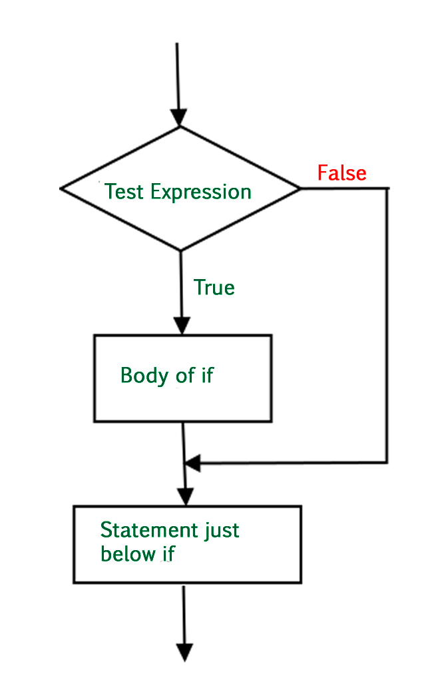
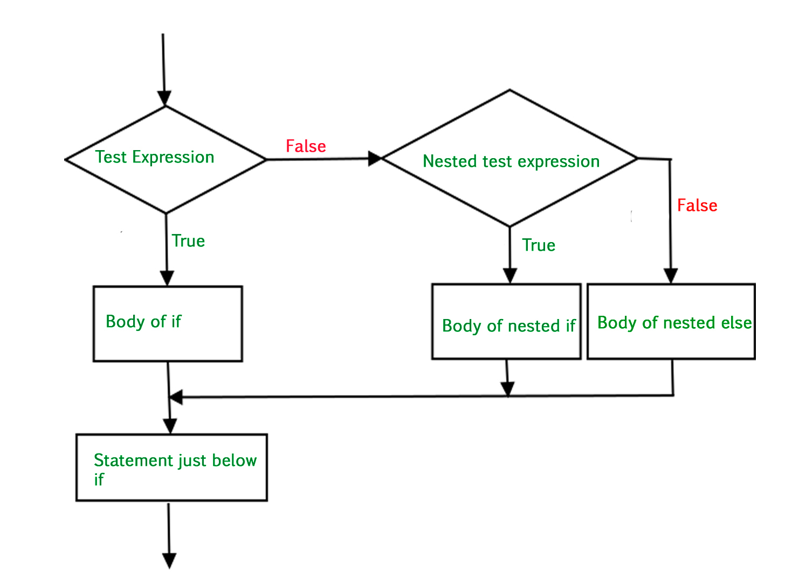
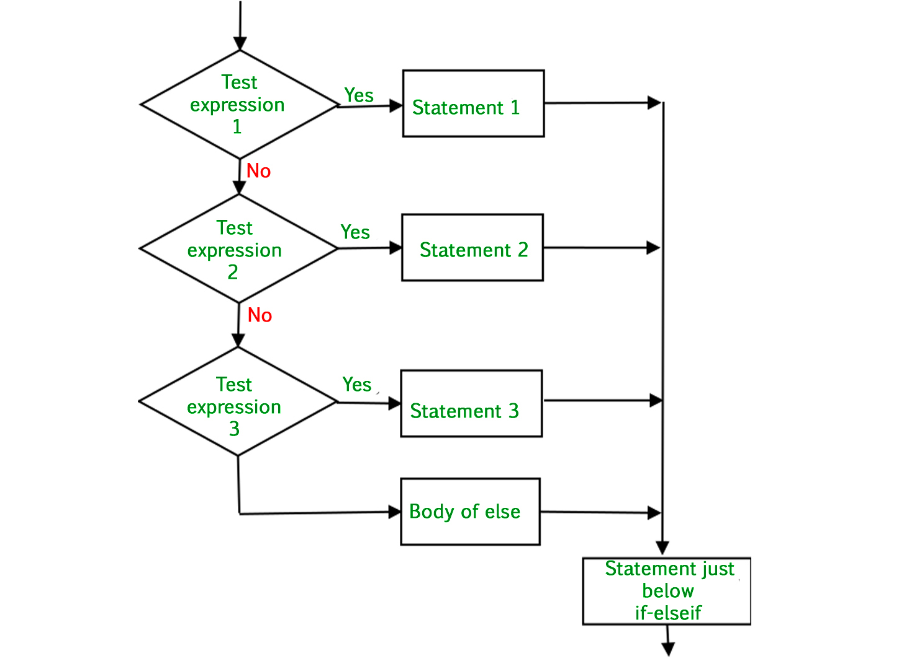

# *

## Decision Making in Python

> _Submitted to @MRichardN_  

### Introduction

__Conditional Statements__, better known as __Control Structures__, direct the _order of execution_ of the statements in a program.  
Decision making statements available in python are:

- `if` statement
- `if`...`else` statements
- nested `if` statements
- `if`...`elif`

### `If` Statements

The `if statement` is how you perform this sort of decision-making. It allows for conditional execution of a statement or group of statements based on the value of an expression.
Below is the simplest most basic _if statement_.

#### Syntax

```python
    if <condition>:
        <statement>
```

- `<condition>` evaluates to a boolean, _True_ or _False_.  
- `<statement>` is a valid python statement; it is _indented_.

If `<condition>` evaluates to __True__, `<statement>` is executed, if __False__, is it _Skipped over_.  
__Examples__  

```python
    >>> x = 0
    >>> y = 5
    ...
    >>> if x < y:
    ...     print("yes")
    ...
    'yes'
    yes
    >>> if y < x:           # Does nothing
    ...     print("yes")
    ...
    >>> i = 10
    >>> if (i > 15):
    ...    print ("10 is less than 15")
    ... print ("I am Not in if")
    ...
    'I am Not in if'

```

__Note__ that the (`:`) that follows `<condition>` is required to define the scope of `<statement>`, other languages require that the `<statement>` is enclosed by _Parenthesis_ `{}`

#### Flow Chart 1



### `If...Else` Statements  

The `if`...`else` statement allows for either of two sets of statements to excecuted based on the value of the condition.  

#### Syntax

```python
    if <condition>:
        <statement x>
            ...
        <statement x>
    else:
        <statement y>
```

If `<condition>` evaluates to __True__, `<statement x>` is executed, if __False__, is it _Skipped over_ and `<statement y>` executed instead.  
__Examples__  

```python
>>> x = 20
>>> if (x < 15):
...     print ("x is smaller than 15")
...     print ("this is the else block")
>>> else:
...     print ("x is greater than 15")
...     print ("this is the else block")
>>> print ("this is the if or else block")
...
```

#### Flow Chart 2


### Nested `If` Statements  

Nested `if` statements means an `if` statement lives _inside_ another if statement.  

#### Syntax

```python
if (condition x):
   <statement one>
   if (condition y): 
      <statement two>
   # if Block x ends here
else:
    <statement three>
# if Block y ends here
```

If `<condition x>` evaluates to __True__, `<statement one>` is executed, __then if__, `<condition y>` evaluates to __True__, `<statement two>` is __also__ executed. But if `<condition x>` evaluates to __False__, the block is skipped and only `<statement three>` is executed.  
__Examples__  

```python
    x = 10
    #  First if statement
    if (x == 10):
        # Nested - if statement
        if (x < 15):
            print ("X is Smaller than 15")
        # Will only be executed if condition above is true
        else:
            print ("X is Greater than 15")
    else:
        print("X is not equal to 10")
        # Will only be executed if 1st condition is false
```

#### FLow Chart 3



### `If`...`Elif`...`Else` Statements

Here, a user can decide among multiple Conditions/Options. If a certain `<condition x>` is `True`, then the corresponding `<statement x1>` is executed, if `False`, it is skipped and the next condition cheked.

### Syntax 

```python
    if (condition):
    statement
    elif (condition):
        statement
    ...
    ...
    else:
        statement
```

The if statements are executed from the top down. As soon as one of the conditions controlling the if is true, the statement associated with that if is executed, and the rest of the ladder is bypassed. If none of the conditions is true, then the final else statement will be executed.
__Examples__

```python
    x = 20
    if (x == 10):
        print ("X is 10")
    elif (x == 15):
        print ("X is 15")
    elif (x == 20):
        print ("X is 20")
    else:
        print ("X is not present")
```

#### Flow Chart 4

