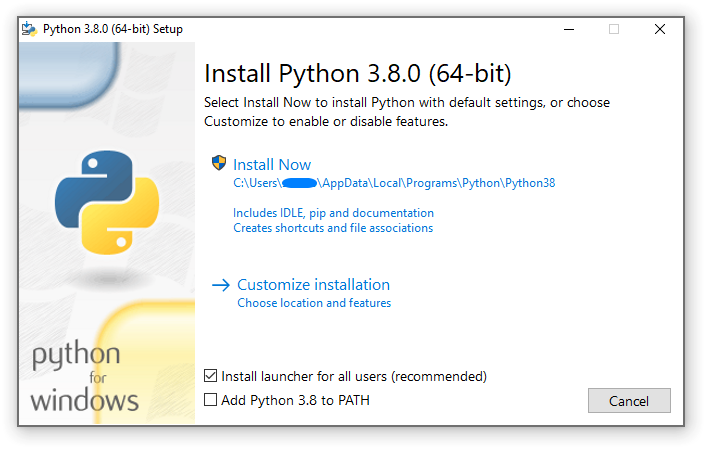

# Python3
[](https://realpython.com/installing-python)
[](https://docs.python.org/3/using/unix.html#getting-and-installing-the-latest-version-of-python)
### Introduction
_**Python** is a general purpose, dynamic, high level, and interpreted programming language._\
\
It supports Object Oriented programming approach to develop applications. It is simple and easy to learn and provides lots of high-level data structures.\
Python is easy to learn yet powerful and versatile scripting language, which makes it attractive for Application Development.\
Python supports multiple programming pattern, including **object-oriented**, imperative, and functional or procedural programming styles.\
In this case, we will focus on _Object Oriented_ programming pattern.

### New Features (3.8)
Python 3.8 came with some pretty exciting features. Regardless of whether or not these new features will be used or not is up to the programmer, but I think it will be important to get familiar with the new features.\
The following are some of my favorite features:
1. The Walrus Operand `:=`
2. Positional only parameters `def func(x,y,f=5,/):`
3. Multiprocessing shared memory
4. CPython — Improved!
5. Performance Improvements (To raw Python itself)
6. Reversible Dictionaries
7. Typing Module Rework
7. F-String Debugging Support `print(f'...{x}..')`\
All the features are welcome advancements in the Python world, especially for those working with large data-sets and tampering with memory limits.\
**4 Min More Read** [HERE](https://towardsdatascience.com/my-favorite-new-features-in-python-3-8-a95d7a0a31c9)

### Installation
To start working with python3, one needs access to the _Python Interpreter_, this can be accomplished in four different ways depending on the operating system:
1. It can be downloaded from the Python Foundation Software [Website](python.org), then run on your machine.
2. Some linux operating systems provide a **Package Installer** that can be run to install python.
3. **Homebrew** is most prefered package installer to use on MacOS to install python3.
4. On mobile operating systems like Android and iOS, you can install apps that provide a Python programming environment sto practice your coding skills on the go.

#### Windows
_Note that windows distributions do not ship with python._
##### 1. Download the Python 3 Installer
- Open a browser window and navigate to the [Download page for Windows](python.org/downloads/windows/) at [python.org](python.org).
- Underneath the heading at the top that says **Python Releases for Windows**, click on the link for the **Latest Python 3 Release - Python 3.x.x**.
- Scroll to the bottom and select either **Windows x86-64 executable installer** for _64-bit_ or **Windows x86 executable installer** for _32-bit_.

##### 2. Run installer
- Once you have chosen and downloaded an installer, simply run it by double-clicking on the downloaded file.

- You want to be sure to check the box that says:
- [x] Add Python 3.x to PATH
as shown to ensure that the interpreter will be placed in your execution path.\
- Then just click Install Now. That should be all there is to it. A few minutes later you should have a working Python 3 installation on your system.

#### Linux
_Note that most if not all linux distributions come with python alredy installed._
It is however most likely that it is not the latest version(Python 2).\
To find out which version is installed, run either of the following commands:\
1. `python --version`
2. `python2 --version`
3. `python3 --version`

If the version show is `Python 2.x.x` or `Python 3.x.x` that is not the latest(Python 3.8.2 of this writing), then you would want to install the latest version.\
The procedure for doing this will depend on the Linux distribution you are running. To find out the version you are using run: 


##### Ubuntu/Linux Mint
_Note that Mint and Ubuntu use the same package management system, therefore they share most commands._\
Depending on the version number you see under Release in the console output, follow the instructions below:
- Ubuntu 17.10, Ubuntu 18.04 (and above) come with Python 3.8 by default. You should be able to invoke it with the command `python3`.
- Ubuntu 16.10 and 17.04 do not come with Python 3.8 by default, but it is in the Universe repository. You should be able to install it with the following commands:
```
~$ sudo apt-get update
~$ sudo apt-get install python3.8
```

##### Fedora
Fedora has a roadmap to switch to Python 3 as the default Python published [here](fedoraproject.org/wiki/FinalizingFedoraSwitchtoPython3). It indicates that the current version and the next few versions will all ship with Python 2 as the default, but Python 3 will be installed. If the python3 installed on your version is not 3.6, you can use the following command to install it:\
`~$ sudo dnf install python36`

##### Arch Linux
Arch Linux is fairly aggressive about keeping up with Python releases. It is likely you already have the latest version. If not, you can use this command:\
`~$ packman -S python`

##### Debian
Debian, generally does not install the sudo command by default. To install it, you’ll need to do the following before you carry out the Compiling Python From Source.\
Below is how to do that:
```
~$ su
~$ apt-get install sudo
~$ vi /etc/sudoers
```
After that, open the /etc/sudoers file using the sudo vim command (or your favorite text editor.) Add the following line of text to the end of the file, replacing your_username with your actual username:\
`your_username ALL=(ALL) ALL`

#### MacOS

#### Android/iOS
If you have an Android tablet or phone and want to practice Python on the go, there are a several options available.\
The one that most reliably supports Python 3.6 is **Pydroid 3**.\
Pydroid 3 features an interpreter you can use for REPL sessions, and it also provides the ability to edit, save, and execute Python code.

**Options:**
- [Pydroid 3](play.google.com/store/apps/details?id=ru.iiec.pydroid3)
- [QPython 3L](play.google.com/store/apps/details?id=org.qpython.qpy3)
- [Pyonic Python3 Interpreter](play.google.com/store/apps/details?id=net.inclem.pyonicinterpreter3)

**_Learning Versions_ (Personal favorites)**
- [Data Camp](play.google.com/store/apps/details?id=com.datacamp)
- [Sololearn](play.google.com/store/apps/details?id=com.sololearn)

